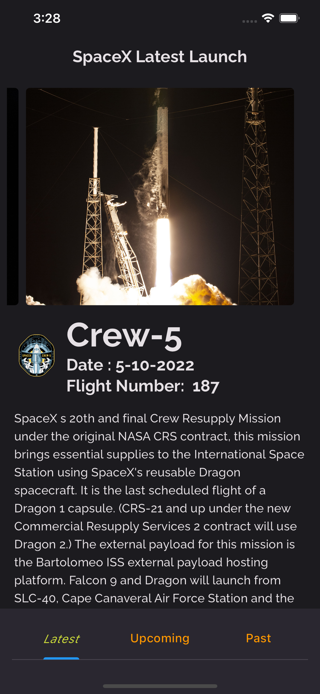
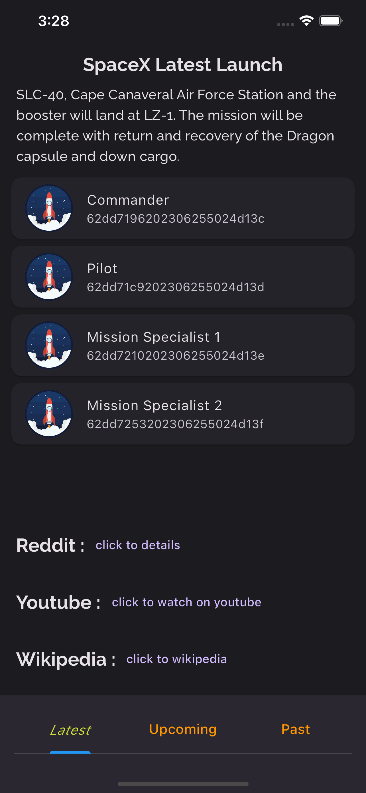
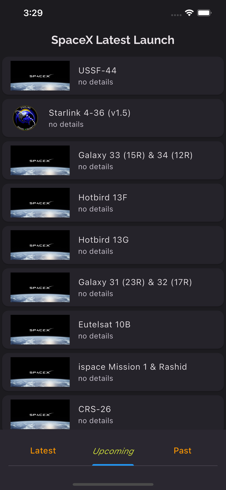
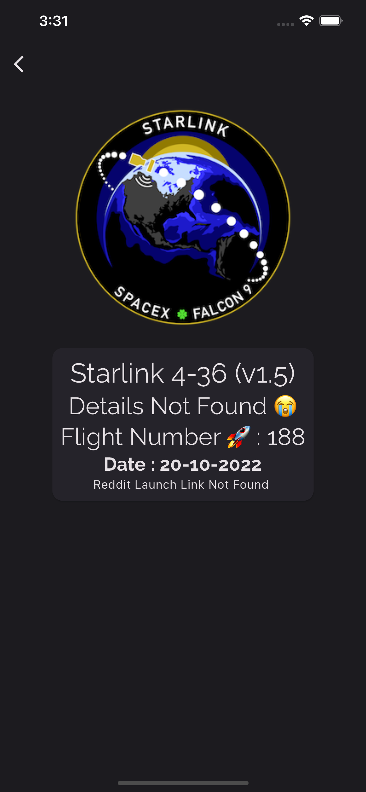
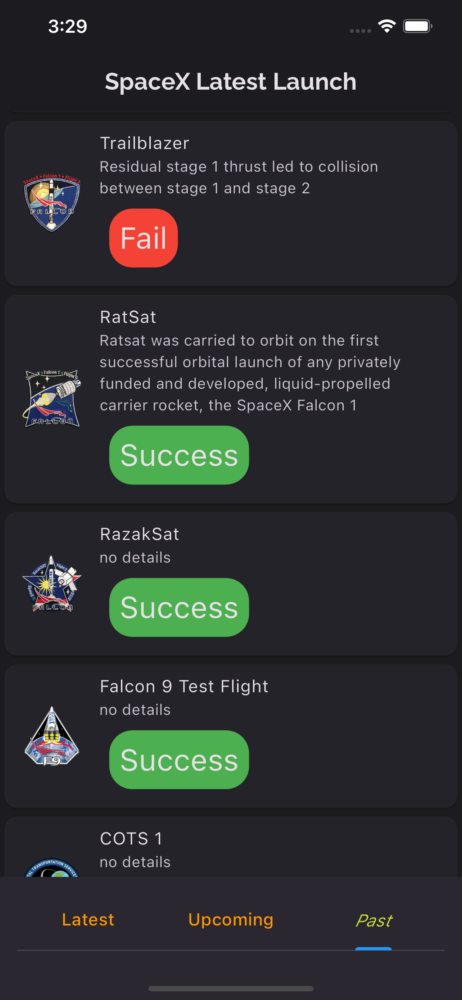
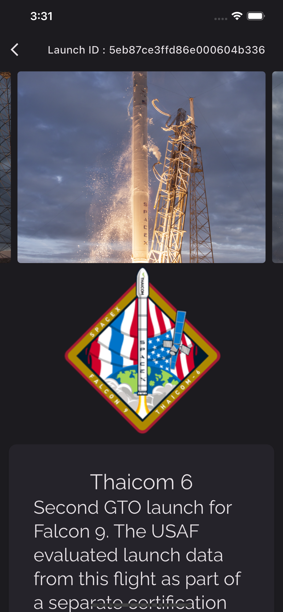
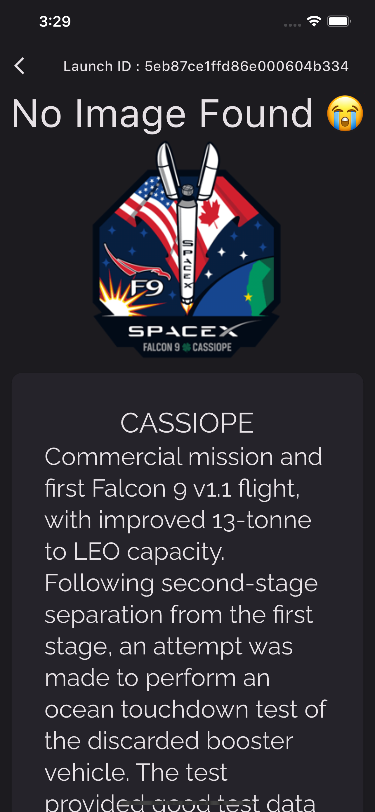

# SpaceX API Flutter 

API =>
 [SpaceX Latest Launch API](https://api.spacexdata.com/v4/launches/latest) 

Bu Flutter uygulaması, SpaceX API'sinden veri çekerek son uçuş, geçmiş uçuşlar ve gelecek uçuşlar hakkında bilgileri görüntülemek için tasarlanmıştır.

## Ekran Görüntüleri

  

    
    
    
Splash, Home

  

  

    
    
    
Splash, Home

  

  

    
    
    
Splash, Home

  

  

    
    
  

##  Packages Used / Kullanılan Paketler

- cupertino_icons: 
- http: 
- equatable: 
- flutter_bloc: 
- kartal: 
- url_launcher: 
- dio: 
- carousel_slider: 
- google_fonts:  

